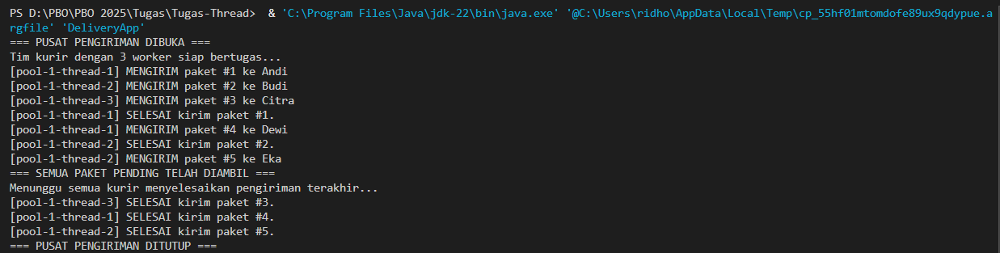

# Tugas-Thread
**Nama:** `[Muhammad Ridho Fahru Rozy]`
**NIM:** `[F1D022076]`

# 🚚 Proyek Antrian Pengiriman Paket (Java Thread + JDBC)

Ini adalah program konsol Java sederhana yang mensimulasikan sistem antrian pengiriman paket.

Program ini menggunakan **JDBC** untuk terhubung ke database MySQL (sebagai "gudang" paket) dan **Java `ExecutorService`** (Thread Pool) untuk bertindak sebagai "tim kurir" yang memproses paket-paket tersebut secara bersamaan (*concurrently*).

## 📜 Deskripsi

Tujuan dari proyek ini adalah untuk mempraktikkan dua konsep utama dari materi kuliah:

1.  **Java JDBC**: Menggunakan pola DAO (Data Access Object) untuk terhubung ke database, mengambil data (`SELECT`), dan memperbarui data (`UPDATE`).
2.  [cite\_start]**Java Concurrency (Thread)**: Menggunakan `ExecutorService` [cite: 791-793] untuk membuat *thread pool* (tim kurir) yang terbatas. Ini mencegah aplikasi membuat ratusan *thread* dan membuat operasi database berjalan di *background* tanpa memblokir *main thread*.

**Alur Program:**

1.  Aplikasi utama (`DeliveryApp.java`) membuat "tim pengiriman" (sebuah `ExecutorService` dengan 3 *thread*).
2.  Aplikasi mengecek ke database (`paket`) apakah ada paket dengan status `PENDING`.
3.  Jika ada, aplikasi memberikan tugas ("kirim paket ini") ke *thread pool*.
4.  Sebuah *thread* (kurir) yang bebas akan mengambil tugas tersebut.
5.  "Kurir" tersebut meng-klaim satu paket dari database, mengubah statusnya menjadi `PROCESSING` (agar tidak diambil kurir lain).
6.  "Kurir" tersebut "tidur" (`Thread.sleep`) selama beberapa detik untuk mensimulasikan waktu pengiriman.
7.  Setelah "terbangun", kurir memperbarui status paket di database menjadi `DELIVERED`.
8.  Aplikasi utama terus melakukan ini sampai tidak ada lagi paket `PENDING` di database.

## 🛠️ Persiapan (Setup)

Sebelum menjalankan program, pastikan Anda telah melakukan 3 hal berikut:

### 1\. Setup Database (MySQL/MariaDB)

Pastikan database `paket` dan tabel `packages` sudah Anda buat. Jika belum, jalankan perintah SQL ini di terminal MySQL atau phpMyAdmin Anda:

```sql
-- 1. Buat database
CREATE DATABASE paket;

-- 2. Pilih database tersebut
USE paket;

-- 3. Buat tabel untuk paket
CREATE TABLE packages (
    id INT AUTO_INCREMENT PRIMARY KEY,
    recipient_name VARCHAR(100),
    address VARCHAR(255),
    status ENUM('PENDING', 'PROCESSING', 'DELIVERED') DEFAULT 'PENDING'
);

-- 4. (Opsional) Isi data awal agar ada yang bisa dikerjakan
INSERT INTO packages (recipient_name, address) VALUES 
('Andi', 'Jl. Merdeka No. 1'),
('Budi', 'Jl. Sudirman No. 2'),
('Citra', 'Jl. Gajah Mada No. 3'),
('Dewi', 'Jl. Pahlawan No. 4'),
('Eka', 'Jl. Kartini No. 5');
```

### 2\. Driver JDBC

Program ini membutuhkan **MySQL Connector/J** (file `.jar`).

1.  Unduh dari: [https://dev.mysql.com/downloads/connector/j/](https://dev.mysql.com/downloads/connector/j/)
2.  Letakkan file `.jar` (contoh: `mysql-connector-j-8.x.x.jar`) ke dalam folder `lib/` di proyek Anda.
3.  Pastikan IDE Anda (seperti VS Code) sudah mengenali JAR ini dan menambahkannya ke *classpath*.

### 3\. Struktur Folder Proyek

Pastikan struktur folder Anda sudah benar untuk menghindari *error* `package does not exist`.

```
Tugas_Antrian_Paket/
├── lib/
│   └── mysql-connector-j-8.x.x.jar
└── src/
    ├── db/
    │   └── DBUtil.java            <-- (Isinya 'package db;')
    ├── model/
    │   └── Package.java           <-- (Isinya 'package model;')
    ├── dao/
    │   └── PackageDAO.java        <-- (Isinya 'package dao;')
    └── DeliveryApp.java           <-- (Tidak punya 'package')
```

### 4\. Konfigurasi Koneksi

Buka file `src/db/DBUtil.java` dan pastikan `URL`, `USER`, dan `PASS` sudah sesuai dengan pengaturan MySQL di XAMPP Anda.

```java
// src/db/DBUtil.java
private static final String URL = "jdbc:mysql://localhost:3306/paket";
private static final String USER = "root";
private static final String PASS = ""; // Default XAMPP (kosong)
```

## 🚀 Cara Menjalankan

Cara termudah adalah dengan membuka folder proyek di IDE (seperti VS Code atau IntelliJ) dan menjalankan file `src/DeliveryApp.java`.

Jika Anda menjalankan dari terminal, Anda perlu meng-kompilasi dan menjalankan dengan menyertakan *classpath* ke driver JDBC:

```bash
# Kompilasi (dari folder 'src')
javac -cp ".;../lib/mysql-connector-j-8.x.x.jar" *.java db/*.java model/*.java dao/*.java

# Menjalankan (dari folder 'src')
java -cp ".;../lib/mysql-connector-j-8.x.x.jar" DeliveryApp
```

## 🖥️ Output Terminal


```